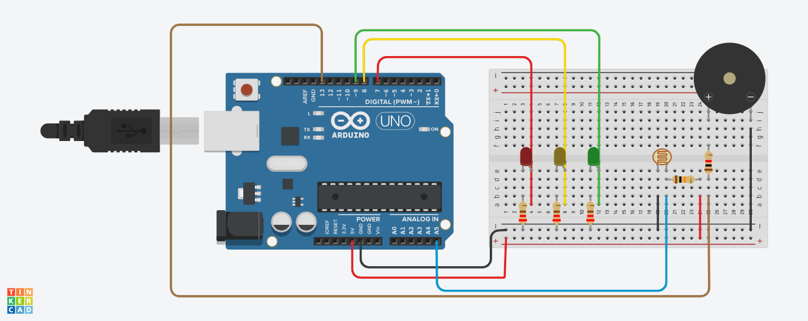

<h1 align="center">🚀 Sensor de Luminosidade para Vinheria Agnello</h1>

<div align="center">
  <strong>🚨 🔧 💡</strong>
</div>
<div align="center">
  Um projeto incrível com Arduino e LDR (Light Dependent Resistor)!
</div>

# Equipe
- Alexandre Freitas Silva 566278
- Henry Cortesi 566085
- Felipe Rodrigues Gomes Ribeiro 562482
- João Vitor Parizotto Rocha 562719
- Giovana Bernardino Carnevali 566196

## 🎯 Objetivo
Desenvolver um sistema de monitoramento de luminosidade utilizando Arduino, capaz de identificar níveis de luz inadequados no ambiente de armazenamento de vinhos da Vinheria Agnello. O sistema sinaliza a condição do ambiente por meio de LEDs e um alarme sonoro, garantindo que os vinhos sejam preservados em condições ideais.

## 🛠️ Componentes
- 1 Arduino Uno
- Arduino IDE
- 1 protoboard
- 1 Led Vermelho
- 1 Led Amarelo
- 1 Led Verde
- 3 resistores de 220Ω
- 1 resistor 10kΩ
- 1 resistor 1kΩ
- 1 buzzer
- 1 LDR
- jumpers

## 📝 Passo a passo interativo

Siga os passos abaixo para iniciar o projeto em seu ambiente local:

1️⃣ **Copie o código no Arduino IDE ou em um simulador**

```
// Sensor de luminosidade Vinheria Agnello
const int ldrPin = A5;

const int ledVerde = 9;
const int ledAmarelo = 8;
const int ledVermelho = 7;
const int buzzer = 13;

void setup() {
  pinMode(ledVerde, OUTPUT);
  pinMode(ledAmarelo, OUTPUT);
  pinMode(ledVermelho, OUTPUT);
  pinMode(buzzer, OUTPUT);

  Serial.begin(9600);
}

void loop() {
  int valorLDR = analogRead(ldrPin);
  int luz;
  luz= map(valorLDR,0,1023,100,0);

  Serial.print("Luminosidade: ");
  Serial.println(luz);

  digitalWrite(ledVerde, LOW);
  digitalWrite(ledAmarelo, LOW);
  digitalWrite(ledVermelho, LOW);
  noTone(buzzer); 

  if (valorLDR <= 300) {
    digitalWrite(ledVerde, HIGH);
  }
  else if (valorLDR > 300 && valorLDR <= 600) {
    digitalWrite(ledAmarelo, HIGH);
    
    // Toca som contínuo por 3 segundos
    tone(buzzer, 1000);  // Tom de 1 kHz
    delay(3000);         // Dura 3 segundos
    noTone(buzzer);      // Para o som
  }
  else {
    digitalWrite(ledVermelho, HIGH);
  }

  delay(600); // Pequena pausa antes de reiniciar o loop
}


```


2️⃣ **Monte o circuito**

   Com a tenção e cuidado monte o seguinte circuito, mas lembre-se, existe outras maneiras de montagem.
    


3️⃣ **Compilar o código**

   Após certificar-se que o arduino está conectado a máquina, compilar seu código ultilizando o atalho ctrl+R ou cessar o comando de compilar na aba Sketch -> Verify/Compile. Em caso de erro, corrigir o código, caso o código estaja correto mas mesmo assim nada acontecer, revise o circuito.


4️⃣ **Confira o resultado**
Teste diferentes iluminações e observe o resultado.
https://www.tinkercad.com/things/7TsxYgzqmFW-sensor-de-luminosidade/editel?returnTo=https%3A%2F%2Fwww.tinkercad.com%2Fdashboard%2Fdesigns%2Fcircuits


<div align="center">
  Espero que este guia tenha sido útil e que você consiga reproduzir esse projeto.🎉😄
</div>
